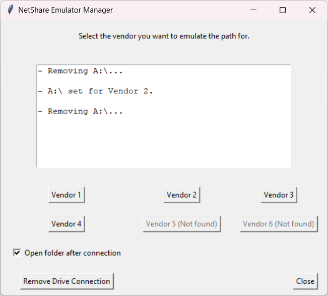

# NetShare Emulation Manager

Picture this: your client (a small growing business) means to transition from a local system of network drives to a cloud based environment (SharePoint). This would be easy, were it not for their immense collection of business logic in the form of Excel datasheets and macros, which are hardcoded to gather information from such network drives, which again are identified by an arbitrary letter. In this situation, folders are named after vendors within a certain local network drive: likewise, in the cloud SharePoint "teams" are called in the same way, but have a different folder structure when syncronized with the OneDrive sync client.

This all in itself is quite the challenge, since you cannot just ignore the problem and move on with the migration: you need somehow to replicate the folder and path infrastructures on top of which the macros work. At the same time you need to deal with the fact that you cannot emulate two vendor folder paths at the same time.

Enter NetShare Emulation Manager, a tool I rewrote from the one I delivered to the client and I stripped of all identifiable information (not that it would be useful anyway, they finally managed to use a proper tool instead of those damn Excel macros).

# tl;dr

In short, this is a Python-based tool for emulating network drive connections in a local environment for legacy (and frankly bad written) Excel macros. It provides a GUI to select various folders within SharePoint synced directory, mapping them to a virtual network drive.

<p align="center">
    
</p>

## Features

- Emulate network connections to a local folder.
- Toggle opening the emulated folder in Windows Explorer.
- Restore the default connection to the local network share.
- Simple and easy-to-use graphical interface using Tkinter.

## Prerequisites

This script expects this folder structure:
```
%userprofile%/
└── SharePoint Company Folder/
    ├── Vendor 1 - General
    ├── Vendor 2 - General
    ├── Vendor 3 - General
    └── Vendor 4 - General
```

Also, it expects the user profile to be in the `C:\` drive. If you'd ever happen to be using a different letter, edit the script accordingly.

## How it Works

- The emulator provides a GUI for selecting a brand, which maps a corresponding local SharePoint folder to the network drive using the `net use` command.
- If the "Open folder" option is selected, it will automatically open the mapped folder in Windows Explorer.

## License

This project is licensed under the MIT License.
